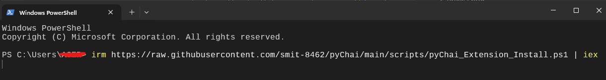
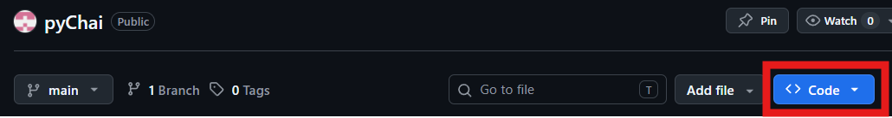
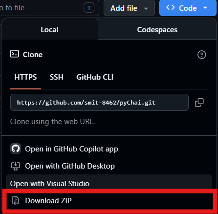
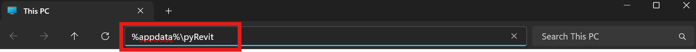
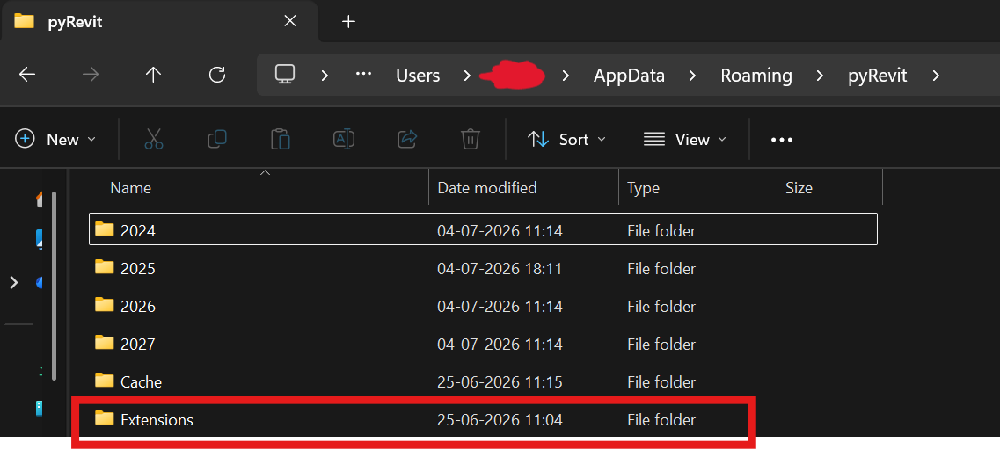
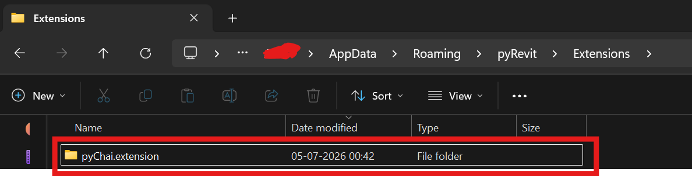
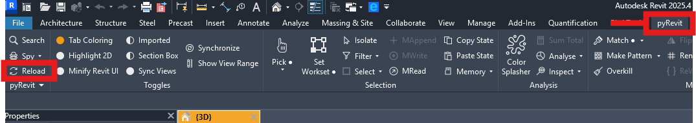

<div align="center">
    <a href="https://github.com/smit-8462/pyChai">
        
    </a>
    <h1>🍵 | pyChai | pyRevit Extension</h1>
</div>


## Introduction

**pyChai** is a free open-source pyRevit extension for Autodesk Revit. It provides a collection of tools, optimizing certain tasks in a Revit workflow.  

For detailed documentation, visit [Kaadya](https://smit-8462.github.io/), where I showcase the journey of pyChai plugin, from ideation to pitfalls encountered along the way.

> Take a sip of chai🍵 and relax.

---
## Tools

Currently, pyChai has following major tools under its arsenal, with more automation scripts planned in near future -

| Tool                                 | Notes                                       |
|--------------------------------------|-----------------------------------------------|
|  Parameter Mapper  |  Apply values on instance parameters of multiple Revit elements from a spreadsheet file  |
<!-- |  Bulk Renamer  |  Rename family types (Built-in/Loaded) based on Revit type parameters  | -->


1. Parameter Mapper  
    - The automation tool spice up the mundane data-entry tasks of filling up values in elements parameters. 
    - The values are extracted from a spreadsheet file (Excel / LibreOffice Calc / CSV) and then applied to element's instance parameters.
    - It gives users option to select any Revit category, along with choice of parameters for applying.
    - The tool has data validation built-in, preventing the wrong data type apply.

---
## Install

There are 2 ways to install pyChai plugin -

<details open>
<summary>Powershell (recommended)</summary>

1. Launch Powershell.
2. Copy the code snippet shown below in the Powershell window - 
    ```powershell
   irm https://raw.githubusercontent.com/smit-8462/pyChai/main/scripts/pyChai_Extension_Install.ps1 | iex
    ```
   
3. Press Enter
4. `pyChai` extension has been successfully installed. Congratulations 🎊!
5. You can read Powershell script [here](https://github.com/smit-8462/pyChai/blob/main/scripts/pyChai_Extension_Install.ps1) in-depth for more information.

</details>


<details>
<summary>Manual installation</summary>

1. Click on `Code` button.  
    
2. Click on `Download ZIP`. It will download the pyChai extension `.zip` file.  
    
3. In File Explorer address bar, enter this folder location -
    ```md
    %appdata%\pyRevit
    ```
   
4. Go to `Extensions` folder. If it doesn't exist, create a folder named "Extensions".  
    
5. Create a folder named `pyChai.extension`.  
    
6. Extract the contents of recently downloaded `.zip` file to `pyChai.extension` folder.
7. In Revit, go to `pyRevit` tab. Click on `Reload` button.  
    
8. `pyChai` extension has been successfully installed. Congratulations 🎊! 

</details>


## Uninstall

There are 2 ways to uninstall/remove the pyChai plugin -

<details>
<summary>Command Prompt (recommended)</summary>

1. Launch Command Prompt.
2. Copy the code snippet shown below in the Command Prompt -  
    ```powershell
    pyrevit extensions delete pyChai
    ```
3. Press Enter.
4. `pyChai` extension has been successfully installed. OUCH 🌧️!

</details>


<details>
<summary>Manual delete</summary>

1. Go to the following path, and delete the `pyChai.extension` folder - 
    ```md
    %appdata%\pyRevit\Extensions
    ```
2. In Revit, go to `pyRevit` tab. Click on `Reload` button.  
    
3. `pyChai` extension has been successfully installed. OUCH 🌧️!

</details>

---
## Update

<details>
<summary>Update pyChai extension</summary>

1. Launch Command Prompt.
2. Copy the code snippet shown below in the Command Prompt -  
    ```powershell
    pyrevit extensions update pyChai
    ```
3. Press Enter
4. `pyChai` extension has been successfully updated. Congratulations 🎊!

</details>

---
## FAQ

> [!CAUTION]
> I am getting error - `ModuleNotFoundError: No module named 'pandas'`

<details>
<summary>Module import error</summary>

### Possible causes

1. The `site-packages` folder might be missing in `pyChai.extension` folder.
2. Some files or Python modules may be missing in `site-packages` folder.
3. Low possibility, due to update there might be change in folder structure.
4. The folder locations stored in `pyRevit_config.ini` file may be outdated/changed.

### Solution

<details open>
<summary>Solution 1 - Delete plugin configurations</summary>  
<br>

- Open the following file in Notepad
    ```txt
    %appdata%\pyRevit\pyRevit_config.ini
    ```
- Delete the lines having `[pyChaiConfigs]`, `cpython_exe_location`, `cpython_plugin_lib_location` & `cpython_external_location` .
- Save the file and close it.
- Now, open the "Parameter Mapper" tool, and try again. It will work.
</details>

<br>

<details open>
<summary>Solution 2 - Replace Python module files</summary>  
<br>

- If issue is still unresolved, try the following steps.
- Delete `site-packages` folder in `pyChai.extension` folder (if any).
- Extract the contents of `.zip` file inside `bin\python_package_zip\` to the root (`pyChai.extension`) folder.
- In Revit, go to `pyRevit` tab. Click on `Reload` button.  
    
- Python modules have been replaced successfully.
- - Now, open the "Parameter Mapper" tool, and try again. It will work.
</details>

</details>

---

<!-- MARKDOWN LINKS & IMAGES -->
[kaadya-blog]: https://smit-8462.github.io/
[linkedin-shield]: 
[linkedin-profile]: https://www.linkedin.com/in/smit-bangare-b04176186/